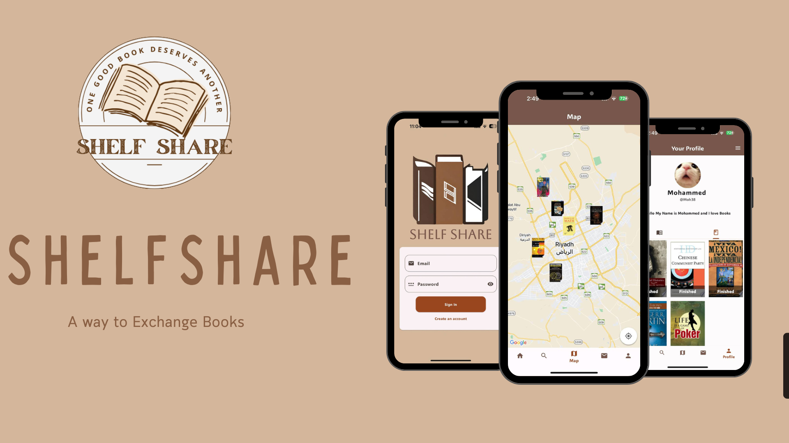

## About This Project
This project has been developed as part of the graduation requirements for the Information Systems program at Imam Mohammad Ibn Saud University. It represents a collaborative effort to showcase our skills and knowledge acquired throughout our studies.

## Introduction and Background

ShelfShare is a book trading app designed to make reading more affordable and accessible. It offers easy book exchanges and promotes sustainable reading habits, with features including user-friendly profiles, geolocation services, in-app messaging, and AI recommendations. This project utlizes technology to enhance book accessibility and affordability, benefiting both readers and the environment.

## Project Objective 

This project aims to provide an efficient and affordable way to exchange books to:

- Enable people to exchange books they have finished reading, so they do not have to buy new ones.

- Enhance user experience by Integrating geolocation features so that nearby users can exchange books with each other, reducing the time and effort needed to exchange books. 

- Use Artificial Intelligence (AI) to tailor book suggestions accoding to the users’ reading history to make the experiance more personal.

## Download The app 

## Project Team

- **Students:**
  - Osama Ali Alzayed
  - Saleh Abdullah Alyahy
- **Supervisor:**
  - Dr.Salem AlJanah

## Contact Information
If you have any questions or would like to reach out, please feel free to email us at:

- **Osama Alzayed**
  - Email: ozayed01@hotmail.com
- **Saleh Alyahy**
  - Email: Salehalyahyaa0@gmail.com
